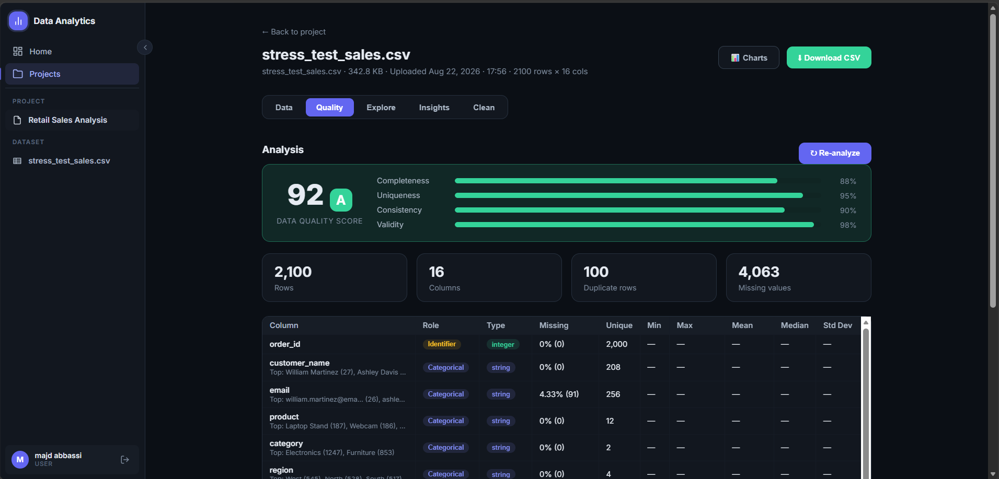
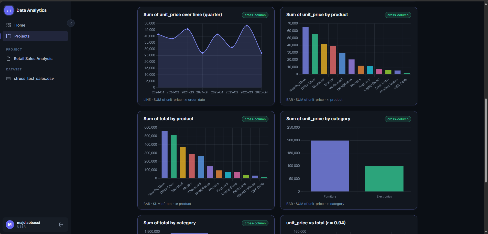
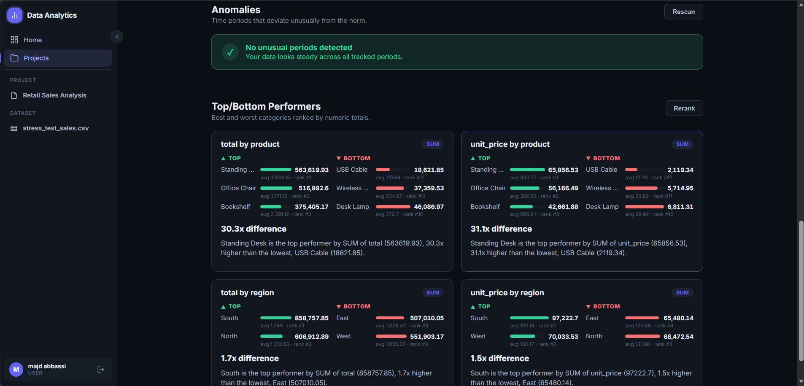
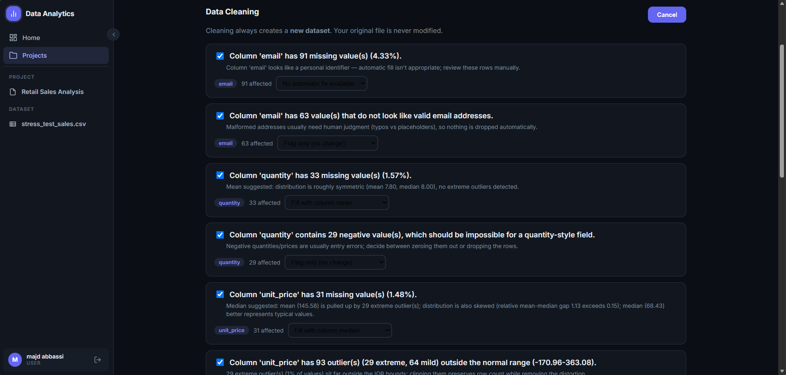
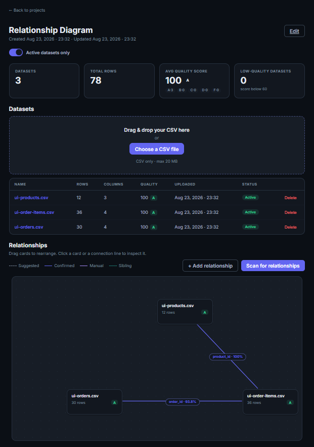

# InsightHub — AI-Powered Data Analytics Platform

[](LICENSE)
[](.github/workflows/ci.yml)
[](frontend)
[](backend)
[](analytics-service)
[](docker-compose.yml)

Upload a CSV, and the platform figures out what's actually in it: what each column *means* (not just its type), where the outliers and correlations are, how clean the data is, and what's trending — then lets you ask an AI assistant about it in plain English.

Built as an end-to-end learning project spanning a full analytics pipeline: ingestion → semantic analysis → cleaning → dashboards → cross-dataset insights → AI assistant.

## 📸 Screenshots

| Data Quality Analysis | Auto-Curated Dashboard |
|---|---|
|  |  |

| Insights (Top/Bottom Performers) | Distribution-Aware Cleaning |
|---|---|
|  |  |



## 🎬 Walkthrough

The 60-second end-to-end demo (upload → analysis → cleaning → dashboard →
insights → relationship diagram → AI assistant) is available as a short GIF:

```text
docs/walkthrough.gif   ← drop your recording here (≤ a few MB)
```

Until the recording is added, see [`docs/DEMO.md`](docs/DEMO.md) for the scripted
tour and use the samples in [`samples/`](samples/) to follow along.

## Demo data

Ready-to-upload sample CSVs live in [`samples/`](samples/): a small,
deterministic e-commerce dataset (customers, orders, order items) engineered
to exercise every feature — semantic classification, relationship detection,
trends, period comparison, anomalies, cleaning suggestions, and duplicate
detection. See [`samples/README.md`](samples/README.md) for what to upload
and what to expect. The files are generated by
[`scripts/generate_samples.py`](scripts/generate_samples.py), and
`scripts/seed-demo.*` will do the whole setup (account → project → uploads)
against a running stack.

## Why this isn't just a CSV viewer

Most portfolio "data analytics" projects stop at showing you column types and a bar chart. This one tries to reason about the data:

- **Semantic column classification**, not just `int`/`string`. Every column is classified into a role — `IDENTIFIER`, `TEMPORAL`, `CATEGORICAL`, `NUMERIC_CONTINUOUS`, `NUMERIC_DISCRETE`, `FREE_TEXT`, `BOOLEAN`, `CONSTANT`, `EMPTY`, `INCONSISTENT` — with a confidence score and reasoning, using content-based detection (95% parse threshold) rather than raw pandas dtypes. This role drives everything downstream: which columns get charted, how missing values get filled, which columns are excluded from cleaning entirely (you don't want to "fix" an ID column).
- **Outlier detection** (IQR, mild/extreme fences) and **correlation detection** (Pearson, |r| ≥ 0.5) run automatically on numeric columns, row-traceable back to the source data.
- **A composite Data Quality Score** (0–100, letter grade) from completeness, uniqueness, consistency, and validity — so "how good is this dataset" is a number, not a guess.
- **Distribution-aware cleaning**, not one-size-fits-all. Missing-value fills pick median vs. mean based on skew; outlier suggestions scale by severity (cap / remove / flag-only); validation checks catch malformed emails, negative prices, invalid dates. Every cleaning run produces a new, traceable dataset version — the original is never touched.
- **Auto-curated dashboards** — chart type and inclusion are chosen by semantic role (histograms for continuous numerics, grouped lines for time series, bar/pie by cardinality for categoricals), with relevance-scored curation so you get the 6–8 charts that matter instead of 40 that don't.
- **Cross-dataset relationships** — the platform scans uploaded datasets for shared keys (e.g. `orders.csv` ↔ `order_items.csv` via `order_id`) and renders them as an interactive, draggable diagram you can confirm, reject, or edit by hand.
- **Insights** — linear-regression trend detection (direction + strength + % change) and period-over-period comparison (with category-driver breakdown), both with confidence flags for small samples.
- **AI assistant** — a chat interface (via a local Ollama model) that can answer questions about a project's data using the analysis already computed, no data leaving your machine.

## Stack

| Layer | Tech |
|---|---|
| Frontend | Angular 21 (standalone components, signals) |
| Backend | Spring Boot 4.1 / Java 21, JWT auth |
| Analytics engine | FastAPI + Pandas (Python) |
| Database | MySQL 8 |
| AI assistant | Ollama (local LLM, no external API calls) |
| Orchestration | Docker Compose |

## Architecture

```text
Angular (nginx) ──/api──> Spring Boot ──> MySQL
                              │
                              ├──> FastAPI/Pandas analytics-service (analysis, cleaning, insights)
                              └──> Ollama (AI assistant)
```

The frontend talks to the backend through an nginx reverse proxy (`/api/*`), so the container never hardcodes a host — same setup works in Docker and in local `ng serve` (via `proxy.conf.json`).

## Running it

```bash
git clone https://github.com/<you>/InsightHub.git
cd InsightHub
cp .env.example .env
# edit .env — JWT_SECRET especially (generate with: openssl rand -base64 64)
docker compose up -d --build
```

First run only — pull the model into the Ollama container:

```bash
docker exec -it data-ollama ollama pull llama3.2:3b
```

### Scripts (one-command helpers)

Bash (Linux/macOS) and PowerShell (Windows) scripts are provided in `scripts/`:

| Script | Purpose |
|---|---|
| `scripts/run-demo.sh` / `.ps1` | Start the stack with one command — auto-generates a JWT secret, builds containers, waits for health |
| `scripts/seed-demo.sh` / `.ps1` | Register a demo user, create a project, and upload the sample CSVs automatically (requires the stack running) |

The assistant's answers are strict-format JSON for query actions, so a model
with better instruction-following gives noticeably stronger results. For a
richer assistant, pull a larger model (e.g. `qwen2.5:7b`) and set
`OLLAMA_MODEL=qwen2.5:7b` in `.env` — the 3b default stays lightweight and
CPU-friendly.

### Service URLs

| Service | URL | Purpose |
|---|---|---|
| Frontend | http://localhost:4200 | Main app |
| Backend API | http://localhost:8080/api | Spring Boot REST API |
| Swagger UI | http://localhost:8080/swagger-ui.html | Interactive OpenAPI docs (springdoc) |
| Analytics service | http://localhost:8000 | FastAPI (internal, also reachable directly) |
| phpMyAdmin | http://localhost:8081 | DB inspection (optional, start with `--profile tools`) |
| Ollama | http://localhost:11434 | LLM (internal, host-mapped for convenience) |

phpMyAdmin is excluded from the default Compose profile to keep startup
light. Start it with the rest:

```bash
docker compose --profile tools up -d
```

### Environment variables

| Variable | Purpose | Default |
|---|---|---|
| `MYSQL_DATABASE` | DB name | — (required) |
| `MYSQL_ROOT_PASSWORD` | DB root password | — (required) |
| `JWT_SECRET` | JWT signing key, ≥32 bytes | — (required) |
| `JWT_EXPIRATION_MS` | Token lifetime | `3600000` (1h) |
| `LOG_LEVEL` | analytics-service log level | `info` |
| `ANALYTICS_SERVICE_URL` | Backend → analytics-service URL | `http://analytics-service:8000` |
| `FILE_STORAGE_PATH` | Uploaded CSV storage path | `/app/uploads` |
| `MAX_FILE_SIZE` / `MAX_REQUEST_SIZE` | Upload limits | `20MB` / `25MB` |
| `OLLAMA_BASE_URL` | Ollama endpoint | `http://ollama:11434` |
| `OLLAMA_MODEL` | Model to use (see the pull note above) | `llama3.2:3b` |
| `OLLAMA_TIMEOUT_SECONDS` | Read timeout (cold model load is slow) | `180` |
| `ANALYTICS_RETRY_MAX_ATTEMPTS` | Retries for transient analytics-service failures (connection / 5xx; 4xx are never retried) | `3` |
| `ANALYTICS_RETRY_BACKOFF_MILLIS` | Initial exponential backoff between retries (doubles, capped at 10s) | `500` |

## What's under the hood, if you want to dig in

- `analytics-service/` — the actual "brains": semantic classification, outlier/correlation detection, quality scoring, cleaning engine, insights (trends + period comparison). Pandas-only, no ML libraries — the classification and scoring are rule-based and hand-tuned against stress-tested ground-truth data.
- `backend/` — auth (JWT), project/dataset ownership model, Flyway-managed schema with the Hibernate `open-in-view` flag off, orchestrates calls to the analytics-service over a retry-able client (exponential backoff on transient failures), persists results, paginated list APIs, relationship detection/CRUD, chat proxy to Ollama, and springdoc OpenAPI docs.
- `frontend/` — Angular signals-based state throughout, custom SVG relationship diagram (no charting library for that one — draggable nodes, edge styling by relationship type), Chart.js for dashboards.

## Test suite

The core math and a few end-to-end paths are covered by real tests, and they
run without any external services. The same three suites run in CI via
GitHub Actions (`.github/workflows/ci.yml`) with coverage reports attached:

| Suite | Command | Coverage |
|---|---|---|
| Analytics (pytest) | `cd analytics-service && python -m pytest` | line coverage via `pytest-cov` (LCOV) |
| Backend (Spring Boot) | `cd backend && ./mvnw test` | instruction/line coverage via JaCoCo |
| Frontend (Vitest) | `cd frontend && ng test --watch=false --coverage` | report via `@vitest/coverage-v8` |

To see the numbers locally, run the suite and open its report: `coverage.lcov`
(analytics), `target/site/jacoco/` (backend), `coverage/frontend/` (frontend).

- `analytics-service/tests/` — pytest suite over the analytics math core:
  semantic column classification, IQR outlier detection, data-quality scoring,
  and the DuckDB read-only sandbox validator. Run with
  `cd analytics-service && python -m pytest` (needs the `requirements.txt`
  packages installed).
- `backend/src/test/java/...` — Spring Boot tests (`mvnw test`) against an
  in-memory H2 (MySQL compatibility mode) via the `test` profile, so they pass
  without a live MySQL. Covers the auth register/login flow (MockMvc, JWT),
  analysis-result persistence/one-to-one uniqueness in JPA, paginated list
  responses over HTTP, OpenAPI docs availability, plus pure unit tests for the
  chat prompt parser, UTF-8 BOM-safe CSV reading, chart aggregation/date
  rollups, and SQL-safe table-name sanitizing.
- `frontend/src/app/**/*.spec.ts` — Vitest smoke tests (`ng test`) for the
  auth guard redirect and the login form.

The heavier insight pipelines (trends, period comparison, cleaning,
relationships) are still verified mainly through targeted scripts and manual
end-to-end checks against engineered CSVs with known ground-truth values (e.g.
a 2,100-row stress test with pre-computed expected outlier counts and
correlation coefficients, cross-checked against actual output).

## Engineering decisions

Key architectural choices and their trade-offs are recorded as lightweight
ADRs in [`docs/adr/`](docs/adr/) and summarized in
[`docs/architecture.md`](docs/architecture.md):

- **JWT stateless auth** with short-lived tokens and client-side expiry checks;
  see [`docs/SECURITY.md`](docs/SECURITY.md) for the (documented) token-storage trade-off.
- **Dedicated analytics-service** (FastAPI + DuckDB) so heavy pandas work never
  starves the REST API; the frontend only ever talks to the Spring backend.
- **Angular standalone components + signals** for maintainable state flow
  (the dataset viewer was split into focused sub-components rather than one
  ~800-line god component).
- **Flyway-managed schema** with Hibernate lazy-loading (open-in-view off)
  and ownership checks on every project/dataset endpoint.
- **Local Ollama** as the LLM — no data or credentials leave your machine.

## Known limitations

- IQR-based validity scoring loses reliability when contamination exceeds ~25% of a column or spans both tails.
- Single local LLM model; no support for swapping providers yet.
