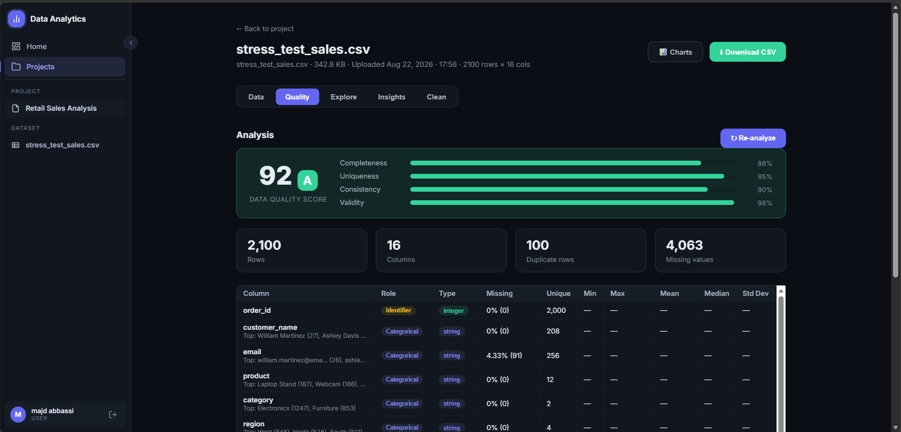
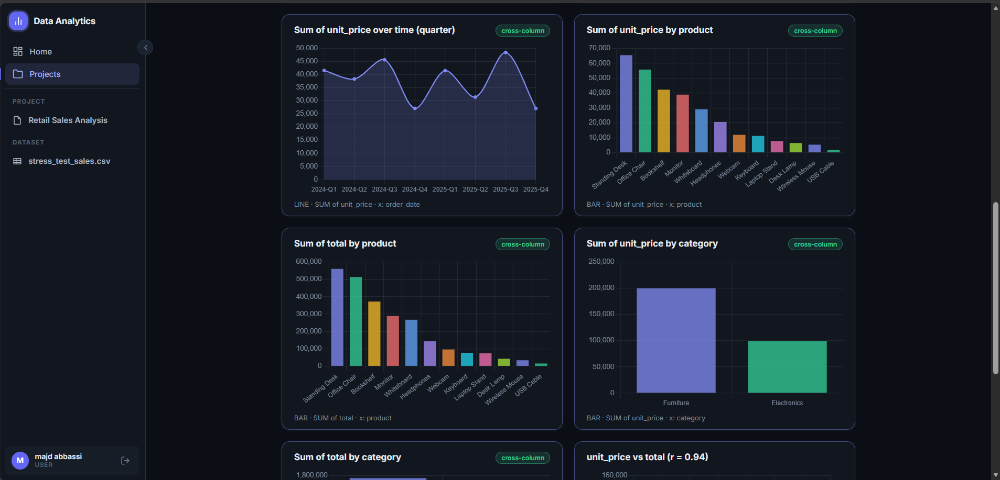
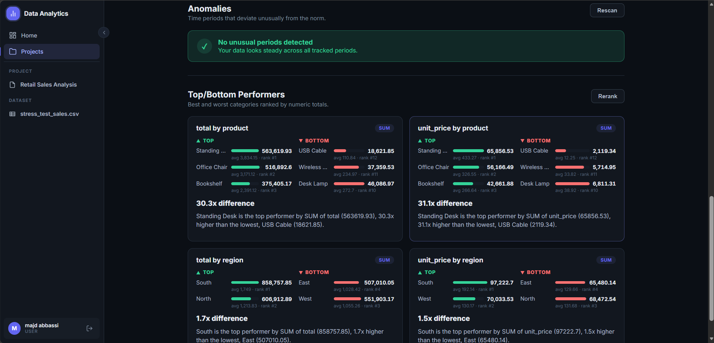
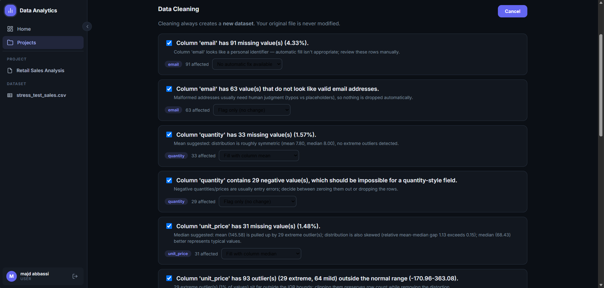
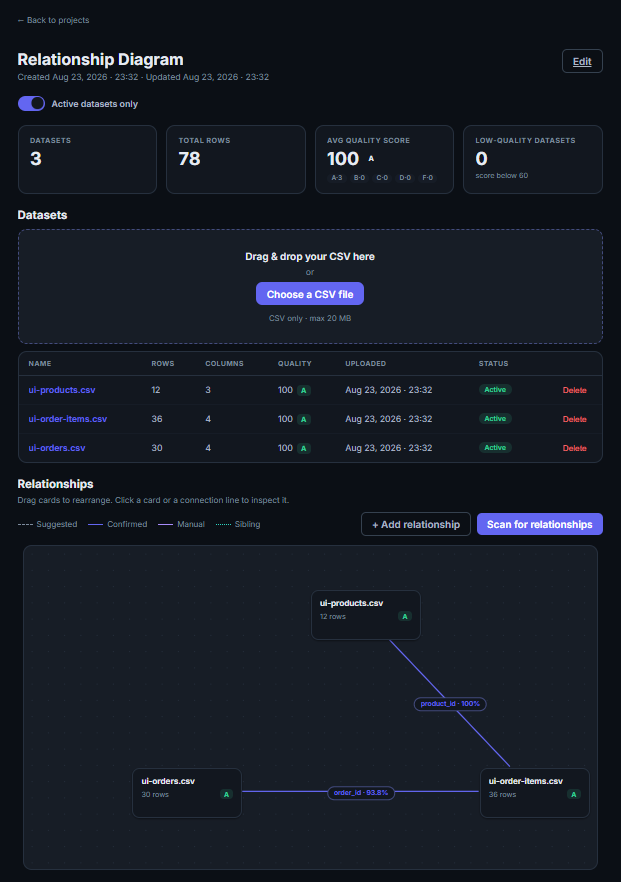
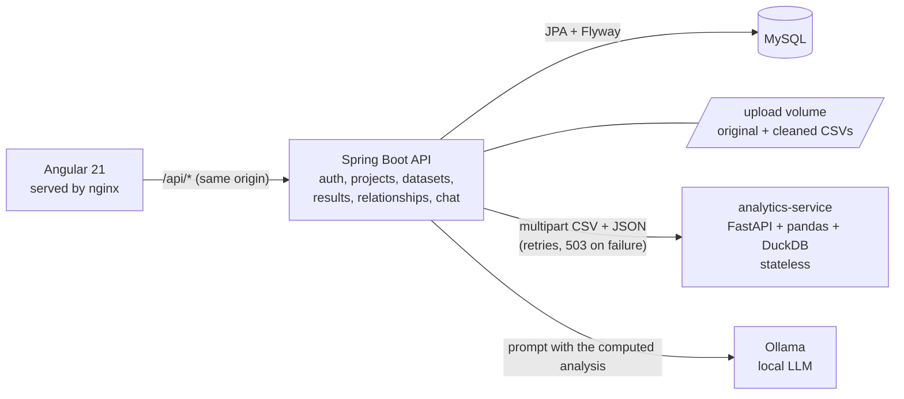

# InsightHub — AI-Powered Data Analytics Platform

[](LICENSE)
[](.github/workflows/ci.yml)
[](frontend)
[](backend)
[](analytics-service)
[](docker-compose.yml)

Upload a CSV, and the platform figures out what's actually in it: what each column *means* (not just its type), where the outliers and correlations are, how clean the data is, and what's trending — then lets you ask an AI assistant about it in plain English, with a model that runs on your own machine.

**Spring Boot 4.1 · Java 21 · FastAPI · pandas · DuckDB · MySQL (Flyway) · Angular 21 (signals) · Ollama · Docker Compose**

There is no public demo on purpose: the assistant needs a local LLM, and the point of the design is that no data leaves the machine. Two scripts start the whole stack and load sample data in a few minutes (see [Run it](#run-it)); [`docs/DEMO.md`](docs/DEMO.md) is a scripted tour.

| Data Quality Analysis | Auto-Curated Dashboard |
|---|---|
|  |  |

| Insights (Top/Bottom Performers) | Distribution-Aware Cleaning |
|---|---|
|  |  |



## Architecture


```mermaid
flowchart LR
    B[Angular 21<br/>served by nginx] -->|"/api/* (same origin)"| S[Spring Boot API<br/>auth, projects, datasets,<br/>results, relationships, chat]
    S -->|JPA + Flyway| M[(MySQL)]
    S --- U[/upload volume<br/>original + cleaned CSVs/]
    S -->|"multipart CSV + JSON<br/>(retries, 503 on failure)"| A[analytics-service<br/>FastAPI + pandas + DuckDB<br/>stateless]
    S -->|prompt with the computed analysis| O[Ollama<br/>local LLM]
```

**Spring owns everything durable**: users, projects, datasets and their versions, analysis results, relationships, and the CSV files on its volume. It checks ownership on every project and dataset request (`findOwnedProject`), so one user can never reach another's data.

**The analytics service is pure computation.** It has no database and no access to the upload volume: for each analysis, Spring streams the stored CSV to it as a multipart upload and gets JSON back (semantic roles, outliers, correlations, quality score, cleaning suggestions, trends, period comparisons, relational insights). `AnalyticsClient` retries transient failures (connection errors and 5xx, never 4xx) with exponential backoff and turns a dead service into a 503 with a friendly message in the UI.

**The assistant** is built in Spring: `ProjectContextBuilder` turns the project's computed analysis into a compact context (cached), `OllamaClient` sends it with the question to the local model, and the answer comes back as strict JSON. When the model proposes a query, it is executed by the analytics service in **DuckDB** over the dataset registered as an in-memory table: `SELECT`/`WITH` only, one statement, registered table names only, 1,000 rows maximum, 5-second timeout, and the DuckDB connection locked against file and network access.

**The frontend** never calls the analytics service or Ollama: nginx forwards `/api/*` to Spring (and `ng serve` does the same with `proxy.conf.json`), so no host is hard-coded.

## Key decisions and trade-offs

Recorded as ADRs in [`docs/adr/`](docs/adr/) and summarized in [`docs/architecture.md`](docs/architecture.md).

1. **A separate, stateless analytics service** ([ADR-004](docs/adr/ADR-004-analytics-service.md)).
   *Why:* pandas work on a large CSV is CPU-heavy and would starve the REST API's threads; Python also has the better data tooling. Keeping it stateless means it can be restarted or scaled without migrations. *Cost:* two deployable units (three with Ollama), the file is re-sent on every analysis, and the table-name sanitizing must stay identical on both sides.
2. **Semantic roles drive everything, not raw types.**
   *Why:* a column of numbers can be an ID, a price or a year; charting or "cleaning" an ID column is wrong. Every column gets a role (`IDENTIFIER`, `TEMPORAL`, `CATEGORICAL`, `NUMERIC_CONTINUOUS`, `NUMERIC_DISCRETE`, `FREE_TEXT`, `BOOLEAN`, `CONSTANT`, `EMPTY`, `INCONSISTENT`) with a confidence and a reason, detected from content (a type counts when ≥ 95 % of values parse). The role then decides charts, fills and exclusions. *Cost:* rules are hand-tuned; [`docs/EVALUATION.md`](docs/EVALUATION.md) records how they were checked against labelled data.
3. **A local LLM through Ollama.**
   *Why:* uploaded data is often private; nothing leaves the machine and no API key is needed. *Cost:* no public demo, answers are only as good as a small CPU model (default `llama3.2:3b`; `qwen2.5:7b` follows the JSON format better), and the first answer waits for the model to load.
4. **The model never touches the database or the files directly.**
   *Why:* LLM output is untrusted input. It only gets the computed analysis as context, and the SQL it writes runs in a throwaway, locked DuckDB connection over one registered dataset. See [Security](#security).
5. **Every cleaning run creates a new dataset version.**
   *Why:* cleaning choices (median vs mean, cap vs remove) are judgment calls; the original is never modified and every version is traceable. *Cost:* storage grows with each version.
6. **Stateless JWT with tokens in `localStorage`** ([ADR-001](docs/adr/ADR-001-jwt-authentication.md), [ADR-002](docs/adr/ADR-002-token-storage.md)).
   *Why:* no session store, simple for a local tool; expiry is checked on start-up and on every read, and any 401 clears the session. *Cost:* a script injected into the page could read the token; [`docs/SECURITY.md`](docs/SECURITY.md) describes the production path (HttpOnly cookies or a BFF). The frontend uses standalone components and signals throughout ([ADR-003](docs/adr/ADR-003-angular-signals.md)).

## Security

- Only `/auth/login`, `/auth/register` and health are public; every project, dataset, insight, relationship and chat endpoint needs a JWT and checks that the project belongs to the caller (another user's project answers 403, an unknown one 404).
- `JWT_SECRET` must be at least 32 bytes; insecure defaults are rejected outside `dev`/`test`. Tokens live 1 hour by default.
- The analytics service, MySQL, Ollama and phpMyAdmin are published on `127.0.0.1` only.

**Found and fixed in review:** the AI query path could read files inside the analytics container. The SQL validator only allowed `SELECT`, but DuckDB table functions such as `read_text('/etc/passwd')` or `read_csv` on a local path are valid `SELECT`s. After the dataset is registered, the connection now runs `SET enable_external_access = false` and `SET lock_configuration = true`, so no query can reach the file system or the network or undo the lock. Regression tests (`TestQuerySandbox`) fail without the fix.

This is a local tool by design; there is no public deployment.

## What it does

- **Semantic column classification** with confidence and reasoning (see decision 2).
- **Outliers** (IQR, mild and extreme fences) and **correlations** (Pearson, reported when |r| ≥ 0.5), traceable back to the source rows.
- **A Data Quality Score** (0–100 with a letter grade) weighting completeness 35 %, consistency 25 %, uniqueness 20 % and validity 20 %.
- **Distribution-aware cleaning:** median or mean fills chosen by skew, outlier actions by severity (cap / remove / flag), validation of emails, negative prices and invalid dates — each run a new version.
- **Auto-curated dashboards:** chart type chosen by role (histograms for continuous numbers, grouped lines for time series, bar or pie by cardinality), ranked by relevance, 7 featured by default instead of 40.
- **Cross-dataset relationships:** shared keys detected across a project's datasets (e.g. `orders.csv` ↔ `order_items.csv` via `order_id`), shown as a draggable diagram you can confirm, reject or edit.
- **Insights:** linear-regression trends (direction, strength, % change), period-over-period comparison with the categories that drove it, top/bottom performers, anomalies — with confidence flags for small samples.
- **AI assistant:** questions about a project's data answered from the computed analysis, and queries run in the DuckDB sandbox.

## Run it

```bash
git clone https://github.com/Majdabbassi/InsightHub.git
cd InsightHub
cp .env.example .env
# edit .env — JWT_SECRET especially (generate with: openssl rand -base64 64)
docker compose up -d --build
docker exec -it data-ollama ollama pull llama3.2:3b     # first run only
```

Or with the helper scripts (Bash and PowerShell versions in `scripts/`):

| Script | Purpose |
|---|---|
| `scripts/run-demo.sh` / `.ps1` | Start the stack: generates a JWT secret, builds the containers, waits for health |
| `scripts/seed-demo.sh` / `.ps1` | Register a demo user, create a project and upload the sample CSVs |

The sample files in [`samples/`](samples/) are a small deterministic e-commerce dataset (customers, orders, order items) built to exercise every feature; [`samples/README.md`](samples/README.md) says what to expect, and [`scripts/generate_samples.py`](scripts/generate_samples.py) regenerates them.

| Service | URL | Purpose |
|---|---|---|
| Frontend | http://localhost:4200 | Main app |
| Backend API | http://localhost:8080/api | Spring Boot REST API |
| Swagger UI | http://localhost:8080/swagger-ui.html | OpenAPI docs (springdoc) |
| Analytics service | http://localhost:8000 | FastAPI (internal, host-mapped on loopback) |
| phpMyAdmin | http://localhost:8081 | optional: `docker compose --profile tools up -d` |
| Ollama | http://localhost:11434 | local LLM |

### Environment variables

| Variable | Purpose | Default |
|---|---|---|
| `MYSQL_DATABASE` | DB name | — (required) |
| `MYSQL_ROOT_PASSWORD` | DB root password | — (required) |
| `JWT_SECRET` | JWT signing key, ≥ 32 bytes | — (required) |
| `JWT_EXPIRATION_MS` | Token lifetime | `3600000` (1 h) |
| `LOG_LEVEL` | analytics-service log level | `info` |
| `ANALYTICS_SERVICE_URL` | Backend → analytics-service URL | `http://analytics-service:8000` |
| `FILE_STORAGE_PATH` | Uploaded CSV storage path | `/app/uploads` |
| `MAX_FILE_SIZE` / `MAX_REQUEST_SIZE` | Upload limits | `20MB` / `25MB` |
| `OLLAMA_BASE_URL` | Ollama endpoint | `http://ollama:11434` |
| `OLLAMA_MODEL` | Model to use | `llama3.2:3b` |
| `OLLAMA_TIMEOUT_SECONDS` | Read timeout (a cold model load is slow) | `180` |
| `ANALYTICS_RETRY_MAX_ATTEMPTS` | Retries for transient analytics failures | `3` |
| `ANALYTICS_RETRY_BACKOFF_MILLIS` | Initial backoff, doubling, capped at 10 s | `500` |

## Tests

All three suites run without external services, and GitHub Actions runs them with coverage reports.

| Suite | Command | Tests |
|---|---|---|
| Analytics (pytest) | `cd analytics-service && python -m pytest` | 42 — semantic classification, IQR outliers, quality scoring, classifier evaluation against labelled fixtures, and the DuckDB sandbox (validator + locked connection) |
| Backend (JUnit) | `cd backend && ./mvnw test` | 54 — auth register/login over MockMvc with JWT, analysis-result persistence, paginated lists, OpenAPI availability, the chat response parser, BOM-safe CSV reading, chart aggregation and date roll-ups, SQL-safe table names (H2 in MySQL mode) |
| Frontend (Vitest) | `cd frontend && ng test --watch=false --coverage` | 12 — the auth guard redirect, the auth service and the login form |

The heavier insight pipelines (trends, period comparison, cleaning, relationships) are verified mainly with scripts and manual end-to-end runs against engineered CSVs with known answers (for example a 2,100-row stress test with pre-computed outlier counts and correlation coefficients).

## Code map

- `analytics-service/` — the analysis core: classification, outliers, correlations, quality score, cleaning engine, insights, DuckDB query sandbox. pandas and DuckDB only; the rules are hand-tuned, no ML libraries.
- `backend/` — auth, project/dataset ownership, Flyway schema (`open-in-view` off), the retrying analytics client, results, relationships, the chat context and Ollama client, springdoc.
- `frontend/` — Angular standalone components with signals, a custom SVG relationship diagram (draggable nodes, edges styled by relationship type), Chart.js dashboards.

## Known limitations

- IQR-based validity scoring loses reliability when contamination exceeds ~25 % of a column or spans both tails.
- One local model at a time; no support for swapping in a hosted provider.
- No public deployment (by design).
