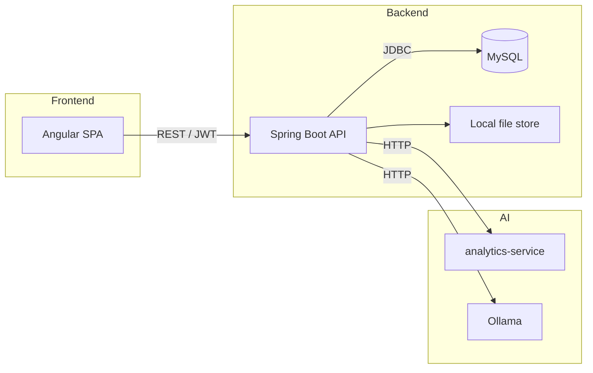
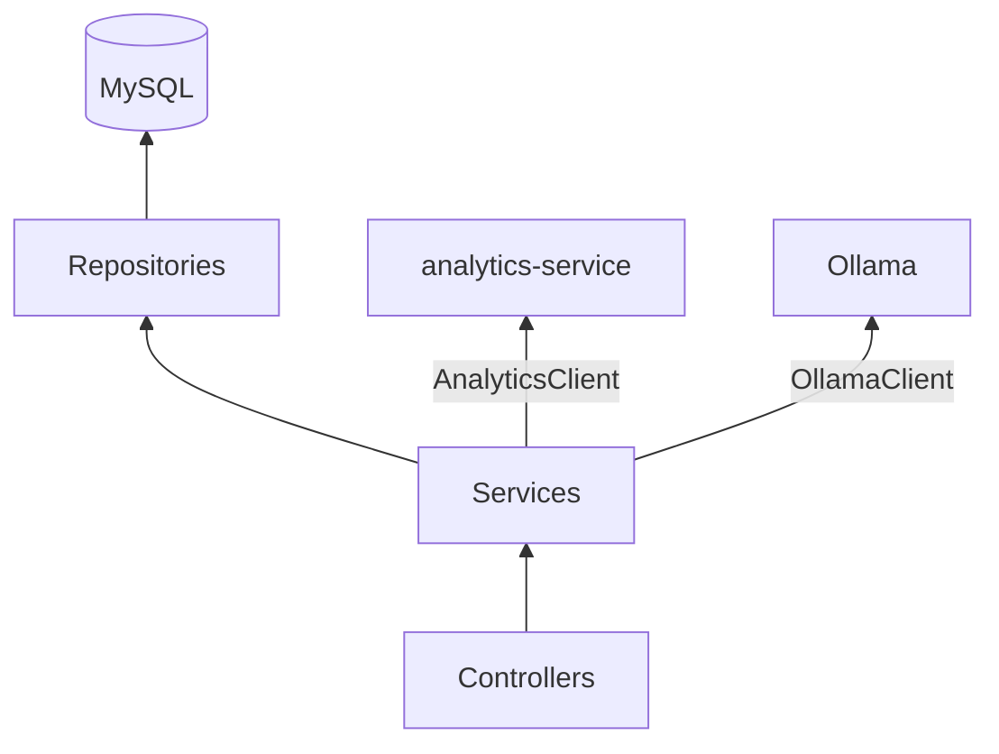
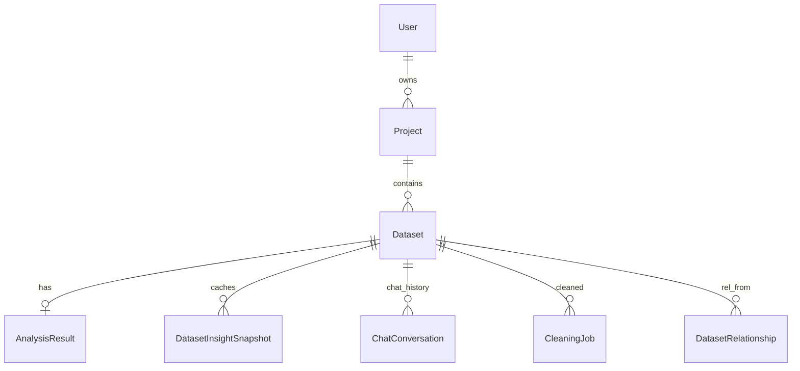

# Architecture

Data Analytics Hub is a three-service platform: an **Angular 21 SPA** (frontend), a **Spring Boot API** (backend), and a **FastAPI analytics-service** powered by DuckDB. Ollama provides on-demand LLM features (chat, chart suggestions).

## System overview

### Responsibilities

| Layer | Role | Key files |
|---|---|---|
| **Frontend** | Auth UI, project/dataset CRUD, tabbed viewer, charts, insights, relationship diagram, chat | `frontend/src/app/features/*` |
| **Backend** | REST API, auth, file storage, persistence, proxies analytics/AI calls | `backend/.../controller/`, `service/` |
| **Analytics-service** | Column stats, quality scoring, cleaning suggestions, trends, outliers, comparisons | `analytics-service/` |
| **Ollama** | Local LLM inference for assistant chat and JSON chart suggestion generation | External |

## Backend layers

### Controllers

- `AuthController` – register / login / me
- `ProjectController` – CRUD, overview, relationship discovery scan
- `DatasetController` – upload, preview, download, trigger analysis, cleaning apply
- `DashboardController` – chart suggestions, chart data
- `InsightsController` – trends, anomalies, comparisons, top performers
- `ProjectInsightsController` – cross-dataset trend/comparison queries
- `ChatController` – conversation history + send (Ollama-backed)
- `RelationshipController` – list / create / confirm / reject / delete
- `HealthController` – liveness probe

### Core services

- `AuthService` / `JwtService` – registration, login, JWT generation/validation (expiry configurable via `JWT_EXPIRATION_MS`, secret via `JWT_SECRET`).
- `ProjectService` / `DatasetService` / `FileStorageService` – CRUD, file upload to local storage.
- `AnalysisService` / `AnalyticsClient` – delegates to analytics-service, caches `AnalysisResult` + `DatasetInsightSnapshot`.
- `CleaningService` – suggestions, applying cleaning actions, persisting `CleaningJob`.
- `DashboardService` / `ChartDataService` / `ChartSuggestionService` – chart suggestion cache, rendered chart data.
- `InsightsService` / `ProjectInsightsService` – trend, comparison, anomaly, performer queries proxied via `AnalyticsClient`.
- `ChatService` / `OllamaClient` – streaming-style LLM chat with history; project context injection.
- `RelationshipService` – cross-dataset join discovery; async scan via `@EventListener` on `RelationshipScanRequestedEvent`.
- `OverviewService` / `ProjectContextBuilder` – aggregate project metadata for the sidebar and LLM context.
- `CsvSupport` / `SqlTableNames` – DuckDB CSV SQL helpers for the analytics layer.

## Data model (core entities)

- `User` – email/password (BCrypt), fullName, role
- `Project` – owner, name, description
- `Dataset` – original file metadata, optional `sourceDatasetId`/`isCleanedVersion` for cleaned derivatives
- `AnalysisResult` – JSON payload from analytics-service; keyed on dataset
- `DatasetRelationship` – pair of datasets, shared columns, match %, status (`SUGGESTED / CONFIRMED / MANUAL / REJECTED`), relationship type (`SIBLING / FOREIGN_KEY`)
- `CleaningJob` – per cleaning run: requested actions, created cleaned dataset id, summary stats
- `ChatConversation` / `ChatMessage` – project-scoped LLM conversation history

## Key flows

### Upload → Analysis → Insights

1. `DatasetController.upload()` stores file via `FileStorageService`, inserts `Dataset` row.
2. User triggers analysis: `DatasetController.analyze()` → `AnalysisService.runAnalysis()` → `AnalyticsClient` HTTP POST; result persisted as `AnalysisResult` + `DatasetInsightSnapshot` (for fast cross-dataset queries).
3. Insights tab loads: frontend calls `InsightsController` endpoints → `InsightsService` reads cached `DatasetInsightSnapshot` or delegates to `AnalyticsClient` as needed.

### Dashboard chart rendering

1. `DashboardController.getCharts()` → `ChartSuggestionService` (generates + caches `ChartSuggestion` list for a dataset; uses Ollama for chart type suggestion generation).
2. Frontend requests `ChartDataResponse` for a chosen suggestion → `ChartDataService` executes DuckDB aggregation via `CsvSupport` and returns Chart.js-compatible datasets.

### Cleaning

1. Frontend opens Clean tab → `DatasetController.suggestions()` → `CleaningService.suggestions()` → `AnalyticsClient`.
2. User selects actions → `DatasetController.clean()` → `CleaningService.applyCleaning()` proxies to `AnalyticsClient`; creates a new cleaned `Dataset` row (`sourceDatasetId` set), records a `CleaningJob`.

### Chat assistant

1. `ChatController.send()` → `ChatService` persists the user message, builds project context (`ProjectContextBuilder` + `ProjectContextCache`), calls `OllamaClient` with the context + conversation, saves assistant reply as `ChatMessage`.

### Relationship scan

1. User clicks Scan → `ProjectController.scan()` publishes `RelationshipScanRequestedEvent`.
2. `RelationshipService` handles the event asynchronously: calls `AnalyticsClient`, persists/updates `DatasetRelationship` rows, responds with created/suggested count.

## Frontend structure

- `core/` – auth services, interceptors, guards, models, shared `AppShell` layout.
- `shared/` – `Icon` component, `chart-theme`, `format` + `errors` utilities.
- `features/` – feature pages: `auth`, `dashboard`, `projects`, `datasets` (viewer → `preview-table`, `quality-analysis`, `cleaning-panel`; `dataset-dashboard`, `chart`, `upload`, insight components).

## Tech stack summary

| Area | Stack |
|---|---|
| Frontend | Angular 21, standalone components, signals, Chart.js (ng2-charts), Vitest |
| Backend | Java 21, Spring Boot 3, Spring Data JPA, Spring Security + JWT, Flyway, springdoc OpenAPI |
| Analytics | Python 3.12, FastAPI, DuckDB, pandas, pytest |
| LLM | Ollama (local) |
| Database | MySQL 8 (Flyway migrations: `V1__init.sql`) |
| Infra | Docker Compose, GitHub Actions CI (`ci.yml`) |

## Documentation map

- `README.md` – quick start, env variables, GIF walkthrough
- `docs/EVALUATION.md` – grading criteria and evidence
- `docs/DEMO.md` – demo script
- `docs/SECURITY.md` – security model and trade-offs
- `docs/architecture.md` – this document
